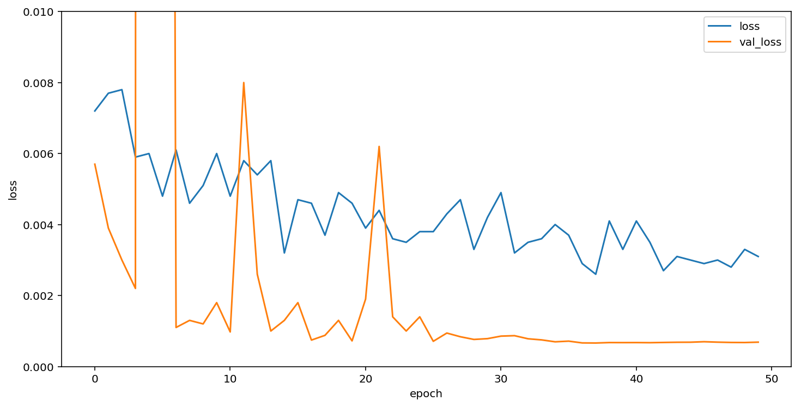

# 四则混合运算识别（初赛）
 
本节会详细介绍我在进行四则混合运算识别竞赛初赛时的所有思路。

核心思想在前面，所以此处会省略部分重复内容。

## 问题描述

本次竞赛目的是为了解决一个 OCR 问题，通俗地讲就是实现图像到文字的转换过程。

### 数据集

初赛数据集一共包含10万张180*60的图片和一个labels.txt的文本文件。每张图片包含一个数学运算式，运算式包含：

3个运算数：3个0到9的整型数字；
2个运算符：可以是+、-、*，分别代表加法、减法、乘法
0或1对括号：括号可能是0对或者1对

图片的名称从0.png到99999.png，下面是一些样例图片（这里只取了一张）：


文本文件 labels.txt 包含10w行文本，每行文本包含每张图片对应的公式以及公式的计算结果，公式和计算结果之间空格分开，例如图片中的示例图片对应的文本如下所示：

```
(3-7)+5 1
5-6+2 1
(6+7)*2 26
(4+2)+7 13
(6*4)*4 96
```

### 评价指标

官方的评价指标是准确率，初赛只有整数的加减乘运算，所得的结果一定是整数，所以要求序列与运算结果都正确才会判定为正确。

我们本地除了会使用官方的准确率作为评估标准以外，还会使用 CTC loss 来评估模型。

## 使用 captcha 进行数据增强

官方提供了10万张图片，我们可以直接使用官方数据进行训练，也可以通过Captcha，参照官方训练集，随机生成更多数据，进而提高准确性。根据题目要求，label 必定是三个数字，两个运算符，一对或没有括号，根据括号规则，只有可能是没括号，左括号和右括号，因此很容易就可以写出数据生成器的代码。

### 生成器

生成器的生成规则很简单：

```py
import string
import random

digits = string.digits
operators = '+-*'
characters = digits + operators + '() '

def generate():
    seq = ''
    k = random.randint(0, 2)
    
    if k == 1:
        seq += '('
    seq += random.choice(digits)
    seq += random.choice(operators)
    if k == 2:
        seq += '('
    seq += random.choice(digits)
    if k == 1:
        seq += ')'
    seq += random.choice(operators)
    seq += random.choice(digits)
    if k == 2:
        seq += ')'
    
    return seq
```

相信大家都能看懂。当然，我写文章的时候又想到一种更好的写法：

```py
import random

def generate():
	ts = [u'{}{}{}{}{}', '({}{}{}){}{}', '{}{}({}{}{})']
	ds = u'0123456789'
	os = u'+-*'
	cs = [random.choice(ds) if x%2 == 0 else random.choice(os) for x in range(5)]
	return random.choice(ts).format(*cs)
```

除了生成算式以外，还有一个值得注意的地方就是初赛所有的减号（也就是“-”）都是细的，但是我们直接用 captcha 库生成图像会得到粗的减号，所以我们修改了 [image.py](https://github.com/lepture/captcha/blob/v0.2.2/captcha/image.py) 中的代码，在 `_draw_character` 函数中我们增加了一句判断，如果是减号，我们就不进行 resize 操作，这样就能防止减号变粗：

```py
# line 191-194
if c != '-':
    im = im.resize((w2, h2))
    im = im.transform((w, h), Image.QUAD, data)
```

我们继而使用生成器生成四则运算验证码：

```py
import string
import os

digits = string.digits
operators = '+-*'
characters = digits + operators + '() '
width, height, n_len, n_class = 180, 60, 7, len(characters) + 1
from captcha.image import ImageCaptcha
generator = ImageCaptcha(width=width, height=height,
	font_sizes=range(35, 56), 
    fonts=['fonts/%s'%x for x in os.listdir('fonts') if '.tt' in x]
)
generator.generate_image('(1-2)-3')
```


上图就是原版生成器生成的图，我们可以看到减号是很粗的。


上图是修改过的生成器，可以看到减号已经不粗了。

## 模型结构

```py
from keras.layers import *
from keras.models import *
from make_parallel import make_parallel
rnn_size = 128

input_tensor = Input((width, height, 3))
x = input_tensor
for i in range(3):
    x = Conv2D(32*2**i, (3, 3), kernel_initializer='he_normal')(x)
    x = BatchNormalization()(x)
    x = Activation('relu')(x)
    x = Conv2D(32*2**i, (3, 3), kernel_initializer='he_normal')(x)
    x = BatchNormalization()(x)
    x = Activation('relu')(x)
    x = MaxPooling2D(pool_size=(2, 2))(x)

conv_shape = x.get_shape()
x = Reshape(target_shape=(int(conv_shape[1]), int(conv_shape[2]*conv_shape[3])))(x)

x = Dense(128, kernel_initializer='he_normal')(x)
x = BatchNormalization()(x)
x = Activation('relu')(x)

gru_1 = GRU(rnn_size, return_sequences=True, kernel_initializer='he_normal', name='gru1')(x)
gru_1b = GRU(rnn_size, return_sequences=True, go_backwards=True, kernel_initializer='he_normal', 
             name='gru1_b')(x)
gru1_merged = add([gru_1, gru_1b])

gru_2 = GRU(rnn_size, return_sequences=True, kernel_initializer='he_normal', name='gru2')(gru1_merged)
gru_2b = GRU(rnn_size, return_sequences=True, go_backwards=True, kernel_initializer='he_normal', 
             name='gru2_b')(gru1_merged)
x = concatenate([gru_2, gru_2b])
x = Dropout(0.25)(x)
x = Dense(n_class, kernel_initializer='he_normal', activation='softmax')(x)
base_model = Model(input=input_tensor, output=x)

base_model2 = make_parallel(base_model, 4)

labels = Input(name='the_labels', shape=[n_len], dtype='float32')
input_length = Input(name='input_length', shape=(1,), dtype='int64')
label_length = Input(name='label_length', shape=(1,), dtype='int64')
loss_out = Lambda(ctc_lambda_func, name='ctc')([base_model2.output, labels, input_length, label_length])

model = Model(inputs=(input_tensor, labels, input_length, label_length), outputs=loss_out)
model.compile(loss={'ctc': lambda y_true, y_pred: y_pred}, optimizer='adam')
```

模型结构像之前写的文章一样，只是把卷积核的个数改多了一点，加了一些 BN 层，并且在四卡上做了一点小改动以支持多GPU训练。如果你是单卡，可以直接去掉 `base_model2 = make_parallel(base_model, 4)` 的代码。

BN 层主要是为了训练加速，实验结果非常好，模型收敛快了很多。

base_model 的可视化：


model 的可视化：


## 模型训练

在经过几次测试以后，我已经抛弃了 evaluate 函数，因为在验证集上已经能做到 100% 识别率了，所以只需要看 val_loss 就可以了。在经过之前的几次尝试以后，我发现在有生成器的情况下，训练代数越多越好，因此直接用 adam 跑了50代，每代10万样本，可以看到模型在10代以后基本已经收敛。



我们可以看到模型先分为四份，在四个显卡上并行计算，然后合并结果，计算最后的 ctc loss，进而训练模型。

## 结果可视化

这里我们对生成的数据进行了可视化，可以看到模型基本已经做到万无一失，百发百中。


打包成 docker 以后提交到比赛系统中，经过十几分钟的运行，我们得到了完美的1分。


## 总结

初赛是非常简单的，因此我们才能得到这么准的分数，之后官方进一步提升了难度，将初赛测试集提高到了20万张，在这个集上我们的模型只能拿到0.999925的成绩，可行的改进方法是将准确率进一步降低，充分训练模型，将多个模型结果融合等。

### 官方扩充测试集的难点

在扩充数据集上，我们发现有一些图片预测出来无法计算，比如 `[629,2271,6579,17416,71857,77631,95303,102187,117422,142660,183693]` 等，这里我们取 117422.png 为例。


我们可以看到肉眼基本无法认出这个图，但是经过一定的图像处理，我们可以显现出来它的真实面貌：

```py
IMAGE_DIR = 'image_contest_level_1_validate'
index = 117422

img = cv2.imread('%s/%d.png' % (IMAGE_DIR, index))
gray = cv2.cvtColor(img, cv2.COLOR_BGR2GRAY)
h = cv2.equalizeHist(gray)
```

然后我们可以看到这样的结果：


当然，还有一张图是无法通过预处理得到结果的，142660，这有可能是程序的 bug 造成的小概率事件，所以初赛除了我们跑了一个 docker 得到满分以外，没有第二个人达到满分。


